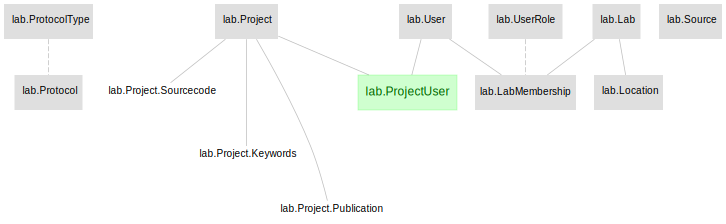
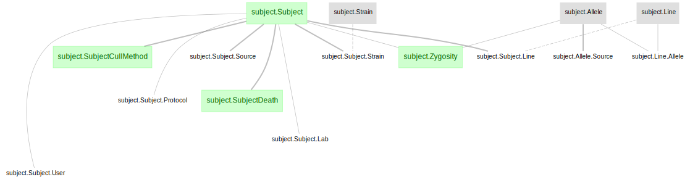
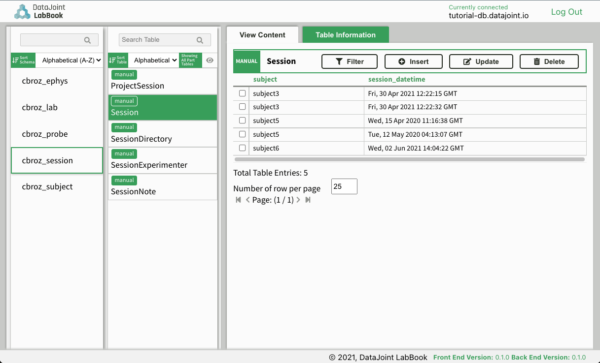

# Workflow for trialization of sessions

This directory provides an example workflow to save the continuous behavior data, using the following datajoint elements
+ [element-lab](https://github.com/datajoint/element-lab)
+ [element-animal](https://github.com/datajoint/element-animal)
+ [element-session](https://github.com/datajoint/element-session)
+ [element-trial](https://github.com/datajoint/element-trial)

This repository provides demonstrations for:
1. Setting up a workflow using different elements (see [pipeline.py](workflow_trial/pipeline.py))
2. Ingestion of data/metadata based on:
    + predefined file/folder structure and naming convention
    + predefined directory lookup methods (see [workflow_trial/paths.py](workflow_trial/paths.py))
3. Ingestion of trialized continuous behavior.

## Workflow architecture
The trialized behavior workflow presented here uses components from three upstream DataJoint elements (element-lab, element-animal and element-session) and assembled together to a functional workflow.

### element-lab



### element-animal

`subject` contains basic information of subjects.


### element-session
`session` is designed to handle metadata related to data collection, including collection datetime, file paths, and notes. Most workflows will include element-session as a starting point for further data entry.


### element-trial
`trial` is designed to segment a continuous recording into trials, repeated windows, typically conditions. Instantaneous or continuous events may occur within trials.
(TBD Diagram here)

`event` is designed to handle paradigms that designate events (e.g., subject behavior) within a session without trials.
(TBD Diagram here)

## Installation instructions

### Step 1 - Clone this repository

+ Launch a new terminal and change directory to where you want to clone the repository
    ```
    cd C:/Projects
    ```
+ Clone the repository
    ```
    git clone https://github.com/datajoint/workflow-trial
    ```
+ Change directory to `workflow-trial`
    ```
    cd workflow-trial
    ```

### Step 2 - Setup a virtual environment
It is highly recommended (though not strictly required) to create a virtual environment to run the pipeline. This can be done with either `virtualenv` or `conda`

+ For `virtualenv`:

    + If not yet installed, run `pip install --user virtualenv`

    + To create a new virtual environment named `venv`:
        ```
        virtualenv venv
        ```

    + To activated the virtual environment:
        + On Windows:
            ```
            .\venv\Scripts\activate
            ```

        + On Linux/macOS:
            ```
            source venv/bin/activate
            ```
+ For `conda`:
    + If not yet installed, run `pip install --user conda`

    + To create a new virtual environment named `venv`:
        ```
        conda create --name venv python=3.8
        ```

    + To activated the virtual environment:
        + On Windows:
            ```
            activate venv
            ```

        + On Linux/macOS:
            ```
            source activate venv
            ```

### Step 3 - Install this repository

From the root of the cloned repository directory:
    ```
    pip install -e .
    ```

Note: the `-e` flag will install this repository in editable mode,
in case you'd like to to modify the code (e.g. the `pipeline.py` or `paths.py` scripts).
If no such modification required, using `pip install .` is sufficient.


### Step 4 - Jupyter Notebook
+ Register an IPython kernel with Jupyter
    ```
    ipython kernel install --name=workflow-trial
    ```

### Step 5 - Configure the `dj_local_conf.json`

At the root of the repository folder,
create a new file `dj_local_conf.json` with the following template:

```json
{
  "database.host": "<hostname>",
  "database.user": "<username>",
  "database.password": "<password>",
  "loglevel": "INFO",
  "safemode": true,
  "display.limit": 7,
  "display.width": 14,
  "display.show_tuple_count": true,
  "custom": {
      "database.prefix": "<neuro_>",
}
```

+ Specify database's `hostname`, `username`, and `password` according to the database you plan to use (see [set-up instructions here](https://tutorials.datajoint.io/setting-up/get-database.html)).

+ Specify a `database.prefix` to create the schemas.


### Installation complete

+ At this point the setup of this workflow is complete.

## Running this workflow

For new users, we recommend using the following notebooks to run through the workflow.
+ [01-Explore_Workflow](notebooks/01-Explore_Workflow.ipynb)
+ [02-Other_Notebook](notebooks/02-Other_Notebook.ipynb)

Once you have your data directory configured with the above convention,
populating the pipeline with your data amounts to these 3 steps:

1. [Connect to a database](https://tutorials.datajoint.io/setting-up/get-database.html)

2. Insert meta information (e.g. subjects, sessions, etc.) - modify:
    + user_data/subjects.csv
    + user_data/sessions.csv

3. Import session data - run:
    ```
    python workflow_trial/ingest.py
    ```

4. Import continuous behavioral data and populate trial or event tables within python:
    ```python
    trial.BehavioralRecording.populate()
    # OR
    event.BehavioralRecording.populate()
    ```

+ For inserting new subjects, sessions or new analysis parameters, adjust the relevant csv and rerun the `ingest.py` script.

+ In fact, these steps can be executed as scheduled jobs that will automatically process any data newly placed into the `get_trial_root_dir`.

## Interacting with the DataJoint pipeline and exploring data

+ Import tables
    ```
    from workflow_trial.pipeline import *
    ```
    This will create all tables defined in the elements in the database server.

+ Preview the tables created by calling the classes, for example:
    ```
    lab.Lab()
    subject.Subject()
    session.Session()
    trial.Trial()
    ```

+ If required to drop all schemas, the following is the dependency order.
    ```
    from workflow_trial.pipeline import *

    trial.schema.drop()
    session.schema.drop()
    subject.schema.drop()
    lab.schema.drop()
    ```

+ For a more in-depth exploration of the tables created, please refer to the example notebooks (TBD).


## Insert into Manual and Lookup tables with Graphical User Interface DataJoint Labbook

DataJoint also provides a Graphical User Interface [DataJoint Labbook](https://github.com/datajoint/datajoint-labbook) to support manual data insertions into DataJoint workflows.



Please refer to the [DataJoint Labbook page](https://github.com/datajoint/datajoint-labbook) for instructions to set it up.

## Development mode installation

This method allows you to modify the source code for `workflow-calcium-imaging`, `element-calcium-imaging`, `element-session`, `element-animal`, and `element-lab`.

+ Launch a new terminal and change directory to where you want to clone the repositories
    ```
    cd C:/Projects
    ```
+ Clone the repositories
    ```
    git clone https://github.com/datajoint/element-lab
    git clone https://github.com/datajoint/element-animal
    git clone https://github.com/datajoint/element-session
    git clone https://github.com/datajoint/workflow-trial
    ```
+ Install each package with the `-e` option
    ```
    pip install -e ./element-lab
    pip install -e ./element-animal
    pip install -e ./element-session
    pip install -e ./workflow-trial
    ```
